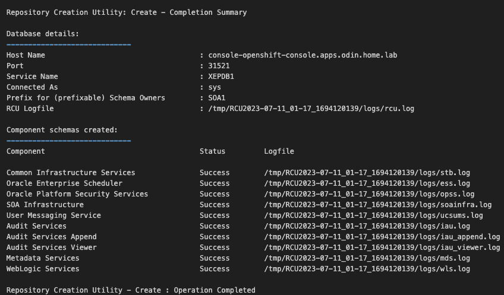
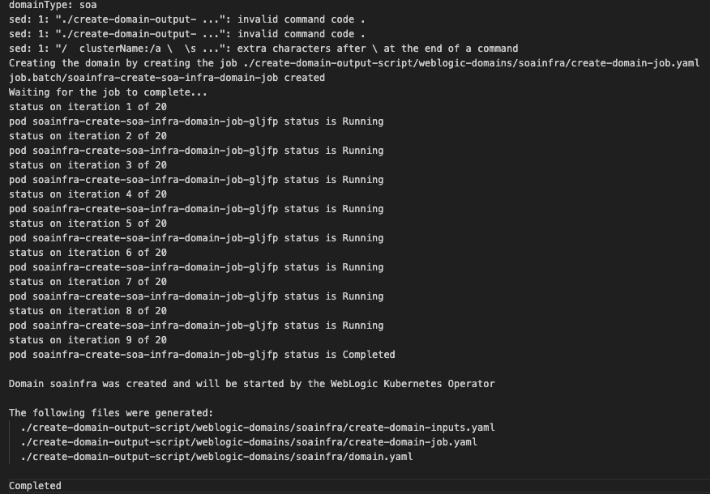

# Installing Oracle SOA Suite on Red Hat OpenShift

This guide provides 2 methods for installing Oracle SOA Suite on Red Hat OpenShift
1. Follow the step by step instructions below to install and configure Oracle SOA Suite
2. Deploy using the provided scripts under the **`oracle-soa-ocp`** folder.


## Prerequisite

Before installing Oracle SOA Suite we need to have access to or set-up the environment with the below software packages:

1. Access to Red Hat OpenShift environment with admin privileges
2. Access to CLI
3. oc client corresponding to the OpenShift environment
4. kubectl
5. podman/docker
6. helm
7. Access to Oracle Environment


## Method 1 - High-level Steps

1. Setup weblogic operator on OpenShift
2. Install Oracle DB on OpenShift or outside of OpenShift (with access to the Oracle DB with sys credentials)
3. Create an Oracle SOA Suite domain


# Preparing the Environment

**Step 1**
Setup the Red Hat OpenShift container platform, you need to have access to the OpenShift console and also to the oc cli.

**Step 2**
To deploy the required resources and execute the operator in a the OpenShift environment, the operator utilizes Helm. Please refer to this [link](https://oracle.github.io/weblogic-kubernetes-operator/managing-operators/preparation/#set-up-the-operator-helm-chart-access) for instructions on installing and using Helm.

**Step 3**
***Install the weblogic operator***

1. Login into the OpenShift CLI
2. Create a new project for the operator
 ```shell
oc new-project <<operator-project-name>>
```
3. Create a service account in the
```shell
oc create serviceaccount -n <<operator project name>> <<service account name>>
```
4. Provide access to the above service account 
```shell
oc adm policy add-scc-to-user privileged system:serviceaccount:oracle-fusion-operator:fmw-operator-sa
```

5. Install the operator using helm (for the latest operator image refer to the oracle website)
```shell
helm install ofm-weblogic-operator weblogic-operator/weblogic-operator --namespace <<operator project name>> --set serviceAccount=<<service account name>> --set image=ghcr.io/oracle/weblogic-kubernetes-operator:4.0.6 --set "javaLoggingLevel=FINE" --wait
```

**Step 4**
***Prepare the environment for Oracle SOA Suite domains***

1. Create a namespace for an Oracle SOA Suite domain
```shell
oc new-project <<domain project name>>
```
2. Label namespace for the weblogic operator to monitor, this is an important step since the operator monitors the namespace based on the label for any domain creation
```shell
oc label namespace <<domain project name>> weblogic-operator=enabled
```
3. Set up the code repository to deploy Oracle SOA Suite domains
```shell
git clone https://github.com/oracle/fmw-kubernetes.git
```
```shell
export WORKDIR=$HOME/soa_23.2.2/fmw-kubernetes/OracleSOASuite/kubernetes
```
4. Next step is to create persistent storage for an Oracle SOA Suite domain. To create the PV and PVC we need to run the scripts from the code directory we cloned in step 3 above. Change directory to
```shell
cd ${WORKDIR}/create-weblogic-domain-pv-pvc`** and run the script >**`./create-pv-pvc.sh -i create-pv-pvc-inputs.yaml -o <<output dir>>
```
5. The above script generates 2 yaml file one for the PV and the other for the PVC depending on your environment you may only need to run the PVC yaml file which will auto create the PV on other environments you will need to adjust the PV yaml parameters to create a PV and then execute the PVC yaml. **Check the PV and PVC files to ensure that the storage class is set to the correct value if not update it to the appropriate storage class**
6. Depending on your environment run the 
```shell
oc create -f ${WORKDIR}/create-weblogic-domain-pv-pvc/<<output dir>>/<<domainUID-domain-pv.yaml>> -n <<domain project name>>
```
followed by
```shell
oc create -f ${WORKDIR}/create-weblogic-domain-pv-pvc/<<output dir>>/<<domainUID-domain-pv.yaml>> -n <<domain project name>>
```
or only run the PVC creation if the PV is auto-provisioned 
```shell
oc create -f ${WORKDIR}/create-weblogic-domain-pv-pvc/<<output dir>>/<<domainUID-domain-pv.yaml>> -n <<domain project name>>
```
7. Next create a secret with domain credentials for the administrative account
```shell
${WORKDIR}/create-weblogic-domain-credentials/create-weblogic-credentials.sh -u weblogic -p Welcome1 -n <<domain project name>> -d <<domainUID>> -s <<secret-name>>
```
8. Next step is to create create a secret with the RCU credentials
```shell
${WORKDIR}/create-rcu-credentials/create-rcu-credentials.sh -u <<username>> -p <<password>> -a <<SYSDBA user name>> -q <<SYSDBA user pwd>> -d <<domainUID>> -n <<domain project name>> -s <<secret name>>
```
The script will create and label the secret.
9. Now we need to configure access to the database for this we need to create a secret with SYSDBA user name and password and RCU schema password.
```shell
oc -n oracle-fusion-domain create secret generic oracle-rcu-secret --from-literal='sys_username=<<sys db user>>' --from-literal='sys_password=<<sys db pwd>>' --from-literal='password=<<RCU schema password>>'
```
10. If you have internet access and you want to pull the image from oracle container registry then we need to create an image pull secret, to create the secret run the command 
```shell
${WORKDIR}/create-rcu-schema/create-image-pull-secret.sh -u <<username>> -p <<pwd>> -e=<<email>> -s <<secret-name>> -n <<domain project name>>
```


**Step 5**
***Setup the Oracle DB using Repository Creation Utility***

1. To create the database schemas for Oracle SOA Suite, run the **`create-rcu-schema.sh`** script.
```shell
${WORKDIR}/create-rcu-schema/create-rcu-schema.sh -s <<RCU Schema Prefix>> -t <<RCU Schema Type (osb,soa,soaosb)>> -d <<RCU DB URL>> -n <<domain project name>> -c <<name of secret created in Step 4 list number 14 above>> -i <<Oracle SOA Suite Image (soasuite:12.2.1.4)>> -r SOA_PROFILE_TYPE=SMALL,HEALTHCARE_INTEGRATION=NO
```
2. Monitor the logs for the rcu pod this will take some time once completed the output should look similar to the below screenshot.


**Step 6**
***Create the Oracle SOA Suite Domain***

1. Change directory as **`cd ${WORKDIR}/create-soa-domain/domain-home-on-pv/`**
2. Edit **`create-domain-inputs.yaml`**
3. Refer to the documentation at this [link](https://oracle.github.io/fmw-kubernetes/soa-domains/installguide/create-soa-domains/) for each parameter and its definition.
Some of the key values to adjust are as follows:
- adminServerName
- domainUID
- domainType
- soaClusterName
- Ports as necessary
- osbClusterName
- image
- imagePullSecretName/weblogicImagePullSecretName
- namespace (namespace where the domain needs to be created)
- javaOptions
- persistentVolumeClaimName (created in Step 4 list 9 above)
- rcuSchemaPrefix (specified in Step 5 list 2)
- rcuDatabaseURL
- rcuCredentialsSecret (created in Step 4 list 13 above)
- any other values as needed
4. Once the appropriate values are adjusted above run the below script to generate the domain creation yaml files 
```shell
${WORKDIR}/create-soa-domain/domain-home-on-pv/create-domain.sh -i create-domain-inputs.yaml -o ./create-domain-output-script
```
5. A new pod should appear in the namespace to run the domain creation. The pod name should start with the 
```shell
<<domainUID>>-create-soa-infra-domain-job-<<random>>
```
6. Once the script executes successfully the log output of the above pod should look something like the image below



8. The above script will generate files on the output folder specified in step 4 above, execute the below command to create the domain 
```shell
oc apply -f ${WORKDIR}/create-soa-domain/domain-home-on-pv/create-domain-output-script/weblogic-domains/soainfra/domain.yaml
```
9. Once the deployment is complete create the necessary routes to access the Weblogic Server Administration Console
```shell
oc expose service <<domainUID>>-adminserver --path=/console --name=ofm-admin-server
```
10. Launch the Weblogic Server Administration Console using the route URL

## Method 2

 1. Navigate to the folder **`oracle-soa-ocp/oracle-soa-provision`**
 2. Update the **`deploy-oracle-soa.sh`** script with the appropriate values
 3. Run the **`deploy-oracle-soa.sh`** script
 4. Once the deployment is complete create the necessary routes to access the Weblogic Server Administration Console
```shell
oc expose service soainfra-adminserver --path=/console --name=ofm-admin-server
```
5. Launch the Weblogic Server Administration Console using the route URL
